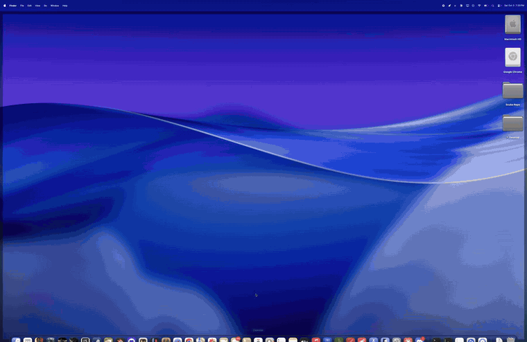
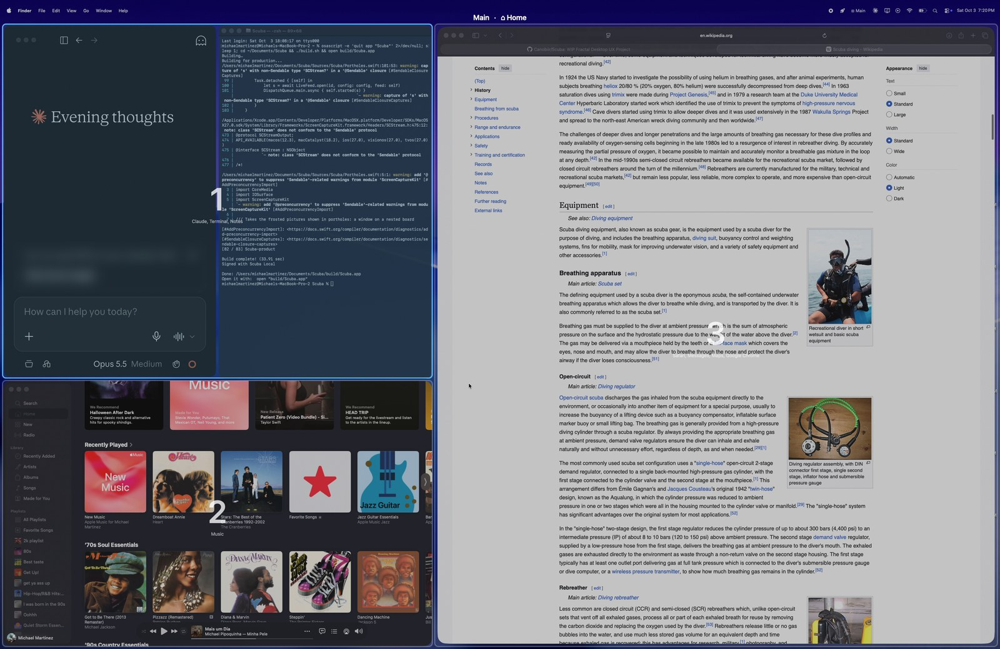
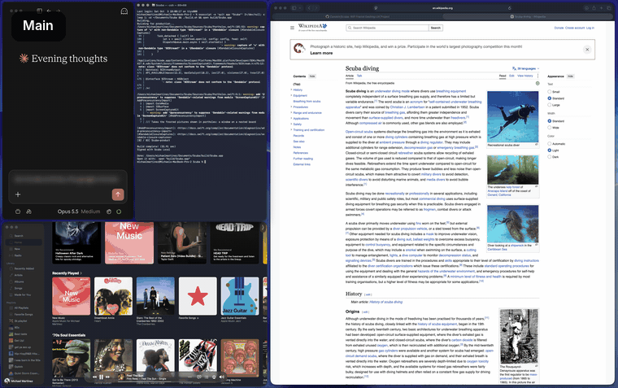
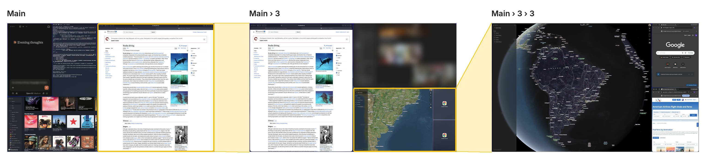
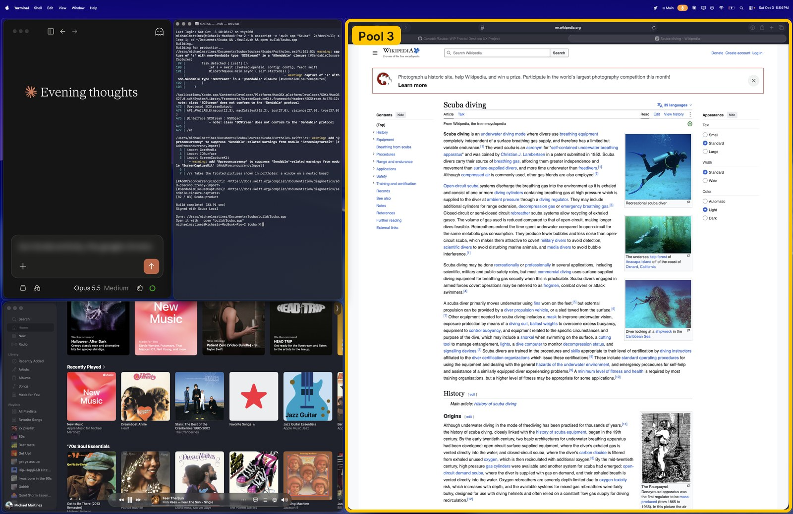
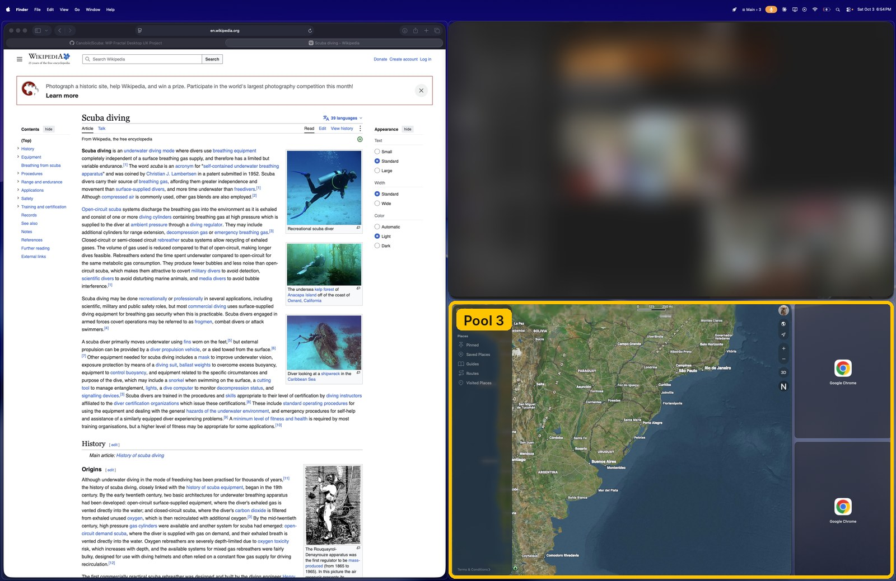
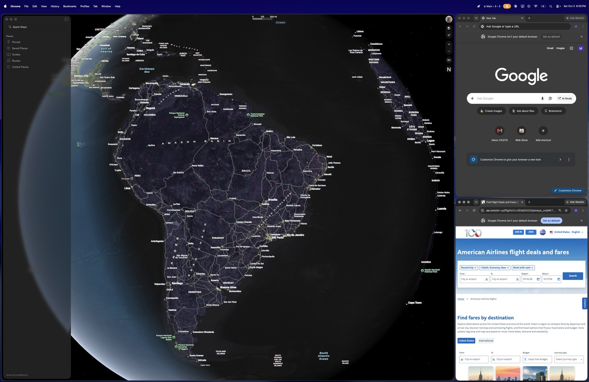
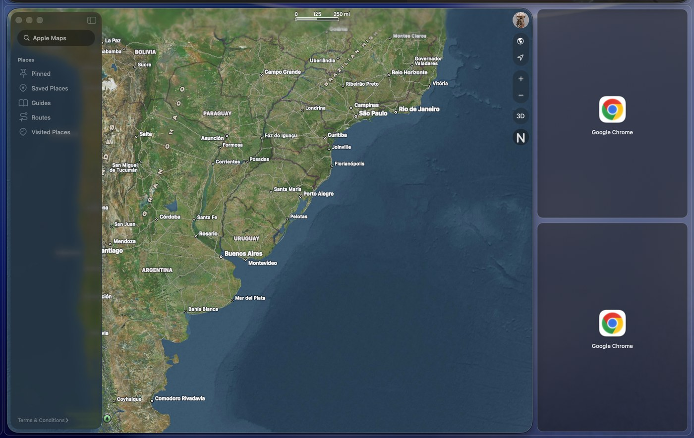
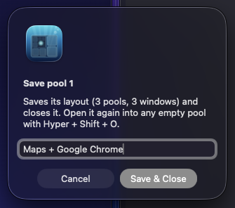

# Scuba User Guide

Scuba is a menu bar app for macOS that arranges your windows into **pools**:
areas of the screen that each hold one or more windows. Any pool can hold a
whole layout of its own, so you can zoom into a pool to work at full size,
then zoom back out to see everything at once.



> **Early test build.** Expect rough edges. Two features are marked **BETA**:
> saved pools and live portholes.

## Contents

1. [Requirements](#1-requirements)
2. [Installing](#2-installing)
3. [First launch](#3-first-launch)
4. [Key ideas](#4-key-ideas)
5. [How zooming works](#5-how-zooming-works)
6. [Moving around](#6-moving-around)
7. [Putting windows into pools](#7-putting-windows-into-pools)
8. [Arranging pools](#8-arranging-pools)
9. [Breathing room: an empty pool when you need one](#9-breathing-room-an-empty-pool-when-you-need-one)
10. [Portholes: windows too big for their pool](#10-portholes-windows-too-big-for-their-pool)
11. [Spotlight: enlarge one window](#11-spotlight-enlarge-one-window)
12. [Hiding windows and pools from the view above](#12-hiding-windows-and-pools-from-the-view-above)
13. [Cut, copy and paste windows](#13-cut-copy-and-paste-windows)
14. [Saved pools (BETA)](#14-saved-pools-beta)
15. [More than one Main, and Home](#15-more-than-one-main-and-home)
16. [Smaller screens](#16-smaller-screens)
17. [Settings](#17-settings)
18. [Keyboard shortcuts](#18-keyboard-shortcuts)
19. [Troubleshooting](#19-troubleshooting)
20. [Uninstalling](#20-uninstalling)
21. [Feedback and bug reports](#21-feedback-and-bug-reports)

---

## 1. Requirements

- A Mac with Apple silicon (M1 or newer)
- macOS 14 (Sonoma) or newer
- A trackpad is recommended: most moves have a three-finger gesture
- A larger or higher-resolution screen works best (see
  [Smaller screens](#16-smaller-screens))

## 2. Installing

### Download a build

1. Go to the [latest release](../../../releases/latest) and download the latest
   **Scuba Test Build.zip**.
2. Unzip it and drag **Scuba** into your **Applications** folder.
3. Double-click Scuba. Because test builds don't come from the App Store,
   macOS says it can't check the app for malware. Click **Done**.
4. Open **System Settings › Privacy & Security**, scroll down, and click
   **Open Anyway** next to the message about Scuba. Confirm with your
   password or Touch ID.

If macOS says the app is "damaged", run this in Terminal, then open Scuba
again:

```
xattr -dr com.apple.quarantine /Applications/Scuba.app
```

### Build from source

You need Xcode or the Xcode Command Line Tools (`xcode-select --install`).

```
git clone https://github.com/Canobiir/Scuba.git
cd Scuba
./build.sh
open build/Scuba.app
```

Each rebuild gets a new signature by default, which makes macOS forget
Scuba's permissions. To keep them across rebuilds, run
`dev/setup-signing.sh` once. It creates a local signing certificate named
"Scuba Local" in your login keychain. If macOS asks whether `codesign` may
use the key, enter your password and click **Always Allow**.

## 3. First launch

A **⊞** icon appears in the menu bar and the **Setup** window opens.

| Permission | Needed? | What it's for |
| --- | --- | --- |
| Accessibility | Required | Moving and resizing other apps' windows. Click **Turn On…** and switch Scuba on in the list. Scuba restarts by itself. |
| Screen Recording | Optional | Zoom animations and porthole pictures. Switch it on, then click **Restart App**. |
| Automation (per browser) | Optional | Saving and reopening browser tabs with [saved pools](#14-saved-pools-beta). macOS asks the first time you save a pool that has a browser in it. |

If a permission is switched on but Setup still shows it in red (common
after a rebuild), click **Fix**. You can reopen Setup at any time from
**⊞ › Setup & Permissions…**.

**Trackpad setting.** macOS also uses three-finger swipes. Go to
**System Settings › Trackpad › More Gestures** and set
**Swipe between full-screen applications** and **Mission Control** to four
fingers, so three-finger swipes go to Scuba.

## 4. Key ideas

**Hyper** means holding **Control + Option + Command** together. Most
shortcuts start with it.

**Your desktop and Main.** Scuba leaves your normal desktop alone. Press
**Hyper + ↑** to go into Scuba's top level, called **Main**. Your desktop's
windows step aside, and your boards appear where you left them. Press
**Hyper + Esc** to go back to your desktop exactly as it was.

**Boards and pools.** A **board** is a full-screen layout divided into
**pools**. Each pool holds one or more windows, either filling the pool or
floating inside it. You start with two pools, side by side.

**Pools inside pools.** Any pool can hold a board of its own. From the
board above, you see that inner board in miniature, inside its pool. Zoom
into the pool and the inner board fills the screen.

**Numbers and paths.** Every board numbers its own pools, and a pool keeps
its number when you add or delete others. The menu bar shows where you are
as a path: **Main › 3 › 3** means pool 3 inside pool 3 of Main. Hold
**Hyper** to see the numbers and names of the pools on screen.



## 5. How zooming works

Zooming into a pool makes that pool fill the screen. If the pool holds a
board of its own, that board's pools open up to full size. Zooming out does
the opposite.





Here is the same example step by step.

**Step 1: Main.** This board has four pools. Pool 3, on the right, holds a
board of its own. From up here it shows only Safari, because the other pools
inside it are hidden from this view (see
[Hiding](#12-hiding-windows-and-pools-from-the-view-above)).



**Step 2: Main › 3.** After zooming into pool 3, its own board fills the
screen: Safari, Messages (blurred in this screenshot), and in the bottom
right another pool 3, which holds Maps and two Chrome windows. The Chrome
windows can't shrink that small, so they show as
[portholes](#10-portholes-windows-too-big-for-their-pool).



**Step 3: Main › 3 › 3.** After zooming into that pool, Maps and both
Chrome windows are full size and usable.



Zoom out twice to get back to Main. Nothing moved: each board keeps its
layout until you change it.

Rearranging works the same way. When pools are added, removed or resized,
or a window turns into a porthole, the windows glide to their new places.
A window that's slow to resize stays hidden behind its picture until it's
ready, so you only see the finished layout.

## 6. Moving around

| To | Trackpad | Keyboard |
| --- | --- | --- |
| Go from your desktop to Main | Hold Hyper and swipe down with three fingers | Hyper + ↑ |
| Zoom into the pool under the pointer | Swipe down with three fingers, or pinch out over empty space | Hyper + scroll up |
| Zoom into the pool you're working in | | Hyper + ↑ |
| Zoom into pool number N | | Hyper + Shift + N |
| Zoom out one level | Swipe up with three fingers, or pinch in over empty space | Hyper + ↓ |
| Go back to your desktop from anywhere | Swipe down with three fingers on a gap between windows, or hold Hyper and swipe up | Hyper + Esc |
| Go to the next or previous board on the same level | Swipe left or right with three fingers | Hyper + ] or Hyper + [ |
| Go to the top level | | Hyper + 0 |
| See every board at once | Zoom out past Main | Hyper + O |

Swipes follow your fingers: lift early, or swipe back, and the view returns
to where it was.

**Stepping through to your desktop.** Your normal desktop sits behind your
boards. Swipe down with three fingers with the pointer on bare background
(the gap between two windows, or wallpaper a pool leaves showing) and the
view dives through that spot to your desktop. Over a window, the same swipe
zooms into its pool as usual; over an empty pool, it opens that pool. To go
back, swipe up with three fingers on your desktop: it pulls back out through
the same spot to where you were.

**Zooming out past Main.** Keep zooming out from Main and it shrinks into
its place on the **Overview**: all your Mains side by side, with every board,
pool and window on them. From there, click anything (or swipe down over it)
and the view zooms straight into it, on any Main. Hyper + ↑ zooms back into
where you were, and Esc closes the Overview. Zooming out from the Overview
doesn't take you to your desktop; Hyper + Esc does.

Two more ways to get somewhere:

- **Double-click a window's title bar.** If the window is on a board inside
  the one you're on, Scuba zooms straight to that board. On the board you're
  on, it goes into Spotlight instead.
- **Switch to an app** (Cmd + Tab, or the Dock). If its windows are on
  another board, Scuba takes you there. Opening a *new* window instead
  (Cmd + N) keeps you where you are, and the window joins your board.

## 7. Putting windows into pools

- **Open an app while you're on a board.** Its new window joins the board:
  an empty pool first, where it fills the pool. If every pool is in use, it
  opens in [Spotlight](#11-spotlight-enlarge-one-window), enlarged over the
  board: drag it onto a pool to place it. If you leave it there and go back
  to another window (or move to another board), it goes to your normal
  desktop instead. Hyper + Return keeps it, floating on top of the pool it
  opened over; Hyper + D sends it to your desktop straight away.
- **Send a window from your desktop.** On your normal desktop, click a window
  and press **Hyper + D**, then pick a pool (named pools are listed first).
  The window fits into the pool as best it can and is hidden from the view
  above, so that board looks the same from outside. Press Hyper + P over it
  on its own board to show it from above too.
- **Drag a window by its title bar.** The pool under the pointer shows
  three kinds of drop target:
  - the **middle bar** makes the window fill the pool,
  - an **edge bar** makes a new pool on that side with the window in it,
  - **anywhere else** leaves the window floating where you dropped it.

  While you drag, the pool's windows move aside to preview the result. Hold
  **Option** when you let go to leave the window alone. You can also throw a
  window: let go while it's still moving and it lands in the pool it was
  heading for.
- **Hyper + 1–9** puts the window you're using into that pool (Hyper + U,
  I, J and K also work for pools 1–4).
- **Hyper + F** switches the window between filling its pool and floating.
- **Hyper + Shift + X** tells Scuba to stop managing the window you're
  using.

## 8. Arranging pools

| Shortcut | Does |
| --- | --- |
| Hyper + N | Add a pool to the right of the current one |
| Hyper + Shift + N | Add a pool below the current one |
| Hyper + Delete | Delete the current pool (its windows move to the pool next to it) |
| Hyper + Shift + Delete | Delete every empty pool on this board |
| Hyper + T | Switch a group of pools between side by side and stacked |
| Hyper + Shift + arrow keys | Grow the current pool toward that side |
| Hyper + drag the gap between pools | Resize pools |
| Hyper + R / Hyper + Shift + R | Name this pool / name this board |
| Hyper + G | Show pool numbers |
| Hyper + Shift + G | Tidy up and renumber pools in reading order |
| Hyper + Z | Undo the last layout change |

You can also drag the edge of a window that fills its pool: the gap moves
with it, and the pool next to it gives way.

## 9. Breathing room: an empty pool when you need one

**Hyper + B** opens an empty pool in the quarter of the screen nearest the
pointer. The rest of the board makes room for it. Press it again to close
it.

Zoom into it and you get an empty full-screen board to work in. Anything
you open there stays inside it; from the board above it's hidden, and the
board looks as it did before. Leave it empty and it closes by itself when
you zoom back out.

When a board has breathing room, the empty pool shows a **lobby**: a button
to go back up, a small map of the board above, and a card for each
neighbouring board. **Hyper + L** shows or hides the lobby. More options are
under **⊞ › Settings › Breathing room**.

## 10. Portholes: windows too big for their pool

Most apps have a minimum window size. On a board inside the one you're on,
pools are smaller, and a window that can't shrink enough would spill over
its neighbours. Instead, it shows as a **porthole**: a picture of the
window, cropped at the edge of its pool, with the app's icon and name.
Windows that fit stay real and usable.



- **Click** a porthole to go to the board where the window is full size.
- **Hyper + click** a porthole to enlarge the window right where you are
  (see [Spotlight](#11-spotlight-enlarge-one-window)).

Choose how portholes look under **⊞ › Settings › Windows & pools ›
Windows too big for a nested pool**:

| Option | What you see |
| --- | --- |
| Frosted portholes (default) | A frosted still picture, cropped at the pool's edge. |
| Live portholes (BETA) | The whole window shrunk to fit, kept up to date. Needs Screen Recording; macOS shows its screen-recording icon while they're on screen; the window's app stays visible in Mission Control. |
| No portholes | Windows that don't fit spill over the pools next to them. |

## 11. Spotlight: enlarge one window

**Click with three fingers** on a window (or a porthole), **double-click its
title bar**, or **Hyper + click** it, to enlarge it over the board,
with a margin of the board still showing around it. **Hyper + click** it
again (or three-finger click it again), or press **Hyper + Return**, to put
it back. The app under the pointer also gets a three-finger click, so do it
somewhere that isn't a button or link. Hyper + click another
window to switch.

**Hyper + D** sends the window in Spotlight (or, without Spotlight, the
window you're using) to your normal desktop instead. It leaves your boards,
and it's there in the middle of the screen when you press Hyper + Esc.

## 12. Hiding windows and pools from the view above

Some windows only make sense at their own level. Hide them, and from the
board above they're gone and the windows next to them spread into the
space. Zoom back in and they're right where you left them.

- **Hyper + P** hides the window under the pointer. Press it again to show
  it.
- **Hyper + Shift + P** hides the whole pool under the pointer.

Each time, a small before-and-after map shows how the view above will
change. Hyper + Z undoes it. Under **⊞ › Settings › Hiding windows & pools**
you can have hidden things show from above as frosted portholes or app icons
instead of disappearing.

## 13. Cut, copy and paste windows

- **Hyper + X** cuts the window you're using. A chip at the bottom of the
  screen shows what you're holding. Go anywhere, point at a pool and press
  **Hyper + V** to put it there. An empty pool takes it whole; a pool in use
  makes room in the half you're pointing at.
- **Hyper + C** copies it instead. After pasting, the same window is in both
  pools: live in one, and a porthole with a two-squares badge in the other.
- You hold one window at a time. Press Hyper + X again on a cut window, or
  click the chip, to put it back.

## 14. Saved pools (BETA)

Save a pool, with everything inside it, and open it again later in any
empty pool. Scuba remembers the pools inside it, their sizes, which apps are
in each, where each window sits, and what's hidden.



| Shortcut | Does |
| --- | --- |
| Hyper + Shift + S | Save the pool under the pointer. Give it a name. |
| Hyper + Shift + W | Save it and close it: its windows close, apps left with no windows quit, and the pool is removed. |
| Hyper + Shift + O | Open a saved pool into the empty pool under the pointer. |

To save a board of pools, zoom out one level and point at the pool that
holds it. To open one as a full board, press Hyper + B, zoom into the new
empty pool, point at it and press Hyper + Shift + O.

What comes back:

- **Apps that were closed** are opened, and each window goes to its spot.
- **Browser windows** (Safari, Chrome, Brave, Edge) come back with their
  tabs. The first time you save a pool with a browser in it, macOS asks
  whether Scuba may control that browser: choose **Allow**, then save the
  pool again, since the tabs aren't saved that first time.
- **Other apps** open a fresh window in the right spot, but not the exact
  document or chat you had open.
- **Single-window apps** (Discord, Messages) can't open a second window if
  they're already open somewhere else.

Everything is also under **⊞ › Saved pools (BETA)**, including forgetting a
saved pool.

## 15. More than one Main, and Home

From Main, swipe sideways with three fingers (or press Hyper + ] ) and a
new, empty Main slides in next to it, like a new desktop Space. Put
something in it and it stays; leave it empty and it goes away. Switching to
an app whose windows are on another Main takes you there.

**Home** is a board you choose. Press **Hyper + Shift + H** on any board to
make it Home, and **Hyper + H** to go there from anywhere.

## 16. Smaller screens

On a 13" or 14" laptop screen, pools inside pools quickly get too small for
most apps, so you'll see more [portholes](#10-portholes-windows-too-big-for-their-pool).
They still let you see what's where, and a click or Hyper + click gets you
to the real window.

For more room for real windows, run the display at a higher resolution:

- **System Settings › Displays › More Space** is built in.
- **[BetterDisplay](https://github.com/waydabber/BetterDisplay)** can go
  further. On a MacBook's built-in screen, the highest resolutions may need
  BetterDisplay Pro, which has a free trial.

Everything on screen gets smaller, but nested pools fit more real windows.

## 17. Settings

Everything is in the **⊞** menu, and every on/off option is under
**⊞ › Settings**:

| Group | Includes |
| --- | --- |
| Motion & feel | Gliding animations, three-finger swipes, stepping through gaps to your desktop, throwing windows, new windows going to empty pools first, dragging a window's edge to move the gap, whether zooming out stops at Main, zooming out past Main showing all your boards |
| Breathing room | Opening it every time you zoom in, which corner it opens in, its size, the lobby, hidden and empty pools folding away from above |
| Hiding windows & pools | Whether hidden things disappear from above or show as frosted portholes or app icons, the before-and-after map |
| Windows & pools | New windows joining the board, new windows opening in Spotlight when every pool is in use, app-icon tiles for tiny pools, portholes, stacks turning side by side on wide screens, pools growing to fit apps that won't shrink, filled windows making room for floating ones, keeping tucked-away windows out of Mission Control |
| Look | Pool outlines, wallpaper zooming as you go deeper, darkening the background on deeper boards |
| Displays | What each extra display does (only shown with more than one display) |

**Reset to two pools** and **Close all board windows & start over** are at
the bottom of Settings.

## 18. Keyboard shortcuts

Press **Hyper + /** in Scuba to see this list on screen.

| Keys | Does |
| --- | --- |
| Hyper + ↑ | Go from your desktop to Main, or zoom into the pool you're working in |
| Hyper + ↓ or Hyper + – | Zoom out one level |
| Hyper + Esc | Back to your desktop from anywhere |
| Hyper + scroll | Zoom into / out of the pool under the pointer |
| Hold Hyper | Show the pools on this board, with names and contents |
| Hyper + 1–9 (or U I J K) | Put the window you're using into that pool |
| Hyper + ← / → | Previous / next pool |
| Hyper + Shift + 1–9 | Zoom into that pool |
| Hyper + Shift + U / I / J / K | Jump into top-level pool 1 / 2 / 3 / 4 from anywhere |
| Hyper + 0 | Go to the top level |
| Hyper + [ / ] | Previous / next board on this level (from Main: another Main) |
| Hyper + O or Hyper + F3 | Overview of all boards (also: zoom out past Main) |
| Hyper + H / Hyper + Shift + H | Go Home / make this board Home |
| Hyper + N / Hyper + Shift + N | Add a pool to the right / below |
| Hyper + Delete | Delete the current pool |
| Hyper + Shift + Delete | Delete every empty pool on this board |
| Hyper + T | Side by side ⇄ stacked |
| Hyper + F | Window fills its pool ⇄ floats |
| Hyper + Shift + arrow keys | Grow the current pool toward that side |
| Hyper + G / Hyper + Shift + G | Show pool numbers / tidy up and renumber |
| Hyper + R / Hyper + Shift + R | Name this pool / this board |
| Hyper + Z | Undo |
| Hyper + B | Open or close breathing room |
| Hyper + L | Show or hide the lobby |
| Hyper + click | Spotlight a window or porthole |
| Hyper + Return | Spotlight the window you're using, or end Spotlight |
| Hyper + D | Send the Spotlight window (or the one you're using) to your desktop; on your desktop, send the window you're using to a pool |
| Hyper + P / Hyper + Shift + P | Hide the window / pool under the pointer from the view above |
| Hyper + X / C / V | Cut / copy / paste a window |
| Hyper + Shift + S / W / O | (BETA) Save a pool / save and close it / open a saved pool |
| Hyper + Shift + X | Stop managing the window you're using |
| Hyper + / | Show all shortcuts |

## 19. Troubleshooting

**Shortcuts or gestures don't do anything.** Check that Accessibility is
on in Setup (**⊞ › Setup & Permissions…**). If another tool uses the same
Control + Option + Command shortcuts (Hammerspoon, for example), quit it.

**A permission is on but still shows red.** This is common after a rebuild.
Click **Fix** in Setup.

**Three-finger swipes switch desktops or open Mission Control.** Change the
trackpad setting described in [First launch](#3-first-launch).

**Windows ended up somewhere odd.** Quit Scuba from the ⊞ menu. Every
window comes back where you can see it. Then open Scuba again.

**Scuba stopped responding.** In Terminal, this records what Scuba is
doing (useful for a bug report), then restarts it:

```
sample Scuba 5 -file ~/Desktop/scuba-hang.txt; killall -9 Scuba; sleep 1; open -a Scuba
```

**A saved pool opened without its browser tabs.** Allow Scuba to control
the browser in **System Settings › Privacy & Security › Automation**, then
save the pool again.

## 20. Uninstalling

1. Quit Scuba from the ⊞ menu.
2. Delete Scuba from Applications (and the source folder, if you built it).
3. Remove Scuba from **Accessibility** and **Screen Recording** in
   **System Settings › Privacy & Security**.
4. Optionally delete `~/Library/Application Support/Scuba`, which holds
   your boards and saved pools.

## 21. Feedback and bug reports

Open an issue on the [Issues page](../../../issues). Helpful details:

- what you were doing when it went wrong,
- your Mac model, macOS version and screen size,
- a screenshot or screen recording, if you can,
- for a freeze, the `scuba-hang.txt` file from
  [Troubleshooting](#19-troubleshooting).

For every feature in detail, see the [feature reference](REFERENCE.md).
